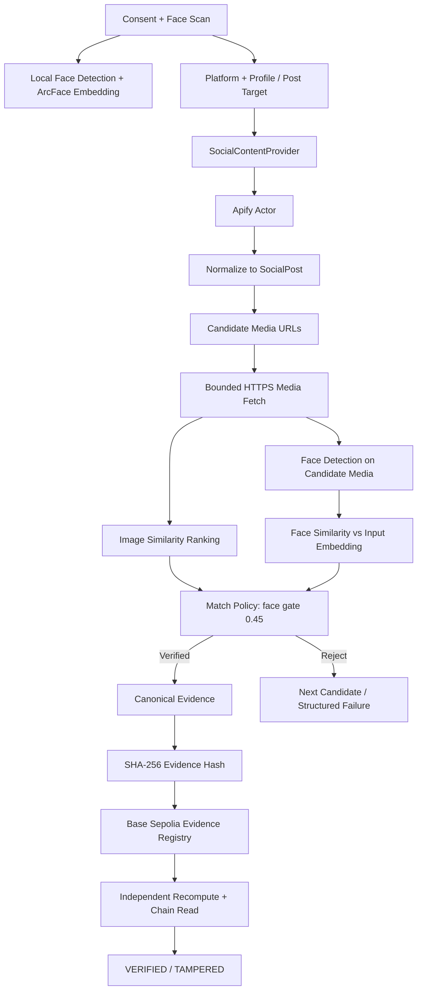
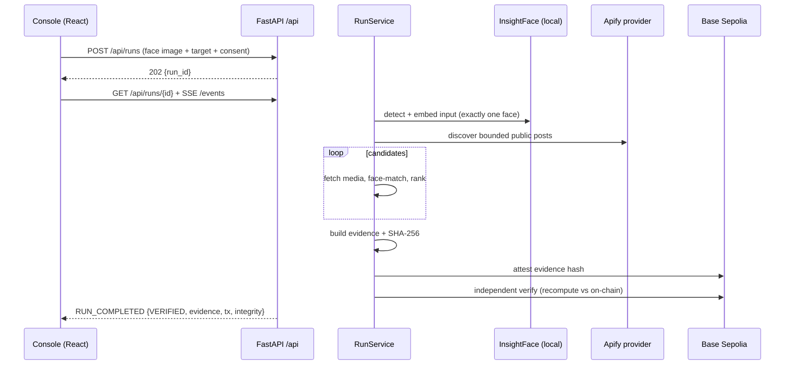

# VeriTrace — Hacker House Goa 2026 · Task 3

**Face scan → user-directed public social discovery → independent face verification → evidence hash → blockchain attestation → independent verification.**

A consent-first pipeline that establishes whether a consented input face appears in
public social content located by a user-supplied social target — with a tamper-evident,
on-chain commitment to the evidence.

**Claim boundary:** this demonstrates *face-to-content correspondence*. It does not prove
legal identity, authorship, account ownership, consent of other depicted people, or
truthfulness of content.

## How it works

1. The user gives explicit consent, uploads one face image, and supplies a **public post
   URL or public profile/username** plus platform.
2. A platform adapter resolves the target into normalized `SocialPost` candidates
   (Apify integration lives behind `app/discovery`; it never declares a match).
3. Each candidate's media is fetched over validated HTTPS and checked locally:
   **face similarity is the acceptance gate** (cosine similarity vs. the input ArcFace
   embedding); perceptual image similarity is supporting evidence only.
4. The first verified candidate produces a canonical `EvidenceRecord`, hashed with
   SHA-256. Selfies, embeddings, and biometric templates never leave the host.
5. The evidence hash — and only the hash — is attested on **Base Sepolia** via
   `EvidenceRegistry.sol`.
6. An independent verifier recomputes the hash and reads the chain back:
   `VERIFIED`, `TAMPERED`, or `BLOCKCHAIN_RECORD_NOT_FOUND`.

## Architecture



Source: [`diagrams/locked-flow.mmd`](diagrams/locked-flow.mmd). Locked design:
[`docs/ARCHITECTURE.md`](docs/ARCHITECTURE.md).

### Runtime request flow (what the UI drives)



Full endpoint/event contract: [`docs/RUN_API.md`](docs/RUN_API.md).

### Evidence lifecycle

```text
post metadata + selected media + match scores + retrieval context
                         |
                         v
                 canonical EvidenceRecord (sorted-key compact JSON)
                         |
                   SHA-256(evidence) ──► media bytes also SHA-256'd separately
                         |
                         v
              Base Sepolia commitment {evidenceHash, attester, attestedAt}
```

Hashing rules: [`docs/DATA_CONTRACTS.md`](docs/DATA_CONTRACTS.md).

## Tech stack

### Backend

| Layer | Technology | Role |
|---|---|---|
| API | FastAPI + Uvicorn | HTTP boundary, run/SSE endpoints, validation |
| Schemas | Pydantic v2 + pydantic-settings | Contracts, env-driven config |
| Face | InsightFace `buffalo_l` (ArcFace) + ONNX Runtime (CPU) | Local detection, quality gates, 512-d embeddings |
| Vision utils | OpenCV (headless) + Pillow | Decoding, face crops |
| Image signal | ImageHash (pHash) | Supporting similarity, never the gate |
| Discovery | Apify Python client (pinned community Actors) | Public-post retrieval behind provider interface |
| Media fetch | HTTPX | Bounded HTTPS fetch with SSRF/private-net defenses |
| Chain client | Web3.py | Attest + independent read-back |
| Contract | Solidity 0.8.24 (`contracts/EvidenceRegistry.sol`) | `attest(bytes32)` / `verify(bytes32)` registry |
| Network | Base Sepolia (chain ID `84532`) | Attestation ledger |
| Language | Python 3.11+ | Type-annotated throughout |

### Frontend (`frontend/` — thin console, backend is source of truth)

| Layer | Technology | Role |
|---|---|---|
| Framework | React 18 + TypeScript (strict) | Operator console components |
| Build | Vite 6 | Dev server + production build |
| Styling | Tailwind CSS 4 | Utility styling, neutral console theme |
| Icons | Lucide React | Status/action icons only |
| Live updates | Server-Sent Events (`EventSource`) | Pipeline, candidates, logs stream |
| State | React state + `useRun` hook | No store library; server state is canonical |
| Tests | Vitest + React Testing Library + jsdom | Reducer, error-copy, API-helper tests |

### Quality gates

| Check | Command |
|---|---|
| Backend tests | `pytest -q` |
| Backend lint | `python -m ruff check app tests` |
| Backend types | `python -m mypy app/runs app/api/runs.py` |
| Frontend tests | `npm test` (in `frontend/`) |
| Frontend lint | `npm run lint` |
| Frontend typecheck + build | `npm run build` |

## Apify integrations

| Platform | Profile | Direct post |
|---|---|---|
| Instagram | `parseforge/instagram-posts-scraper` | `parseforge/instagram-posts-scraper` |
| LinkedIn | `data-slayer/linkedin-profile-posts-scraper` | `fetch_cat/linkedin-posts-scraper` |
| Facebook | `spbotdel/facebook-profile-posts-all-photos-scraper` | `scrapyspider/facebook-post-scraper` |
| Reddit | `scrapers_lat/reddit-scraper` | `scrapers_lat/reddit-scraper` |

Community-maintained Actors confined to `app/discovery`; raw output is normalized to
`SocialPost` immediately and never trusted for matching. Live validation results and
quirks: [`docs/APIFY_VALIDATION.md`](docs/APIFY_VALIDATION.md).

## Repository map

```text
app/
  api/             HTTP boundary (+ run/SSE routes)
  cli/             local operator workflow
  config/          environment/configuration
  discovery/       Apify/platform adapters + normalization
  extraction/      secure candidate media fetching
  face/            face detection/embedding
  matching/        similarity + match policy (face gate 0.45)
  evidence/        evidence model + canonical hashing
  blockchain/      Base Sepolia contract client
  verification/    end-to-end orchestration
  runs/            run lifecycle + SSE event contract (docs/RUN_API.md)
contracts/         EvidenceRegistry.sol
scripts/           deployment utilities (deploy_contract.py)
frontend/          thin verification console (React + Vite)
examples/          demo face input used in live validation
diagrams/          locked-flow.mmd (rendered above)
docs/              architecture / data / security / development / run API / Apify validation
adr/               accepted architecture decisions
tests/             unit/integration/fixture tests (+ fixtures/)
AGENTS.md           contributor project guide
```

## Proven live (Base Sepolia round-trip)

Real end-to-end run `vr_20260907_172601_e145f2`: public portrait in, Instagram profile
`@barackobama` discovery via live Apify (5 posts → 16 candidates), local InsightFace
matching, evidence hash, on-chain attestation, independent read-back.

| Fact | Value |
|---|---|
| Matched post | `https://www.instagram.com/p/Dc1taGQvhFQ/` |
| Face similarity / threshold | `0.840` / `0.45` (`VERIFIED_MATCH`) |
| Evidence SHA-256 | `78df6f32fba18b805c343235c6478cad5a8cc016b5552073568688fb374cce71` |
| Network | Base Sepolia (`84532`) |
| Registry | `0xB46370Ee35FCA3d0FF4C8efaC6A79B8bAaCe6F2a` |
| Attestation tx | `2fa7ab3d630eaa78bf7a9c98a7197f15745c467634a8e77edefcf37e284a76dc` |
| Block | `46516853` (receipt status `1`) |
| On-chain read-back | `exists=True`, recomputed hash matches commitment |
| Final state | **VERIFIED** |

## Local setup

```bash
python -m venv .venv
# Windows PowerShell:
.venv\Scripts\Activate.ps1
# macOS/Linux:
# source .venv/bin/activate

pip install -e ".[dev]"
cp .env.example .env   # then fill in .env.local (never commit it)
```

Environment (names only — values stay in `.env.local`):

| Variable | Required for |
|---|---|
| `APIFY_API_TOKEN` | Live discovery |
| `BASE_SEPOLIA_RPC_URL` | Chain reads/writes |
| `BLOCKCHAIN_PRIVATE_KEY` | Attestation + contract deploy (funded Base Sepolia key) |
| `EVIDENCE_REGISTRY_ADDRESS` | Attestation + verification (from `deploy_contract.py`) |
| `FACE_MATCH_THRESHOLD` | Default `0.45` |
| `MAX_POSTS_PER_PROFILE` | Default `30` |

Run the backend:

```bash
uvicorn app.api.main:app --reload   # :8000
```

Run the console:

```bash
cd frontend
npm install
npm run dev    # :5173, expects the API at http://localhost:8000
```

Deploy the registry (needs RPC URL + funded key in the environment):

```bash
python scripts/deploy_contract.py
```

Face runtime smoke test (downloads `buffalo_l` once, CPU-only, prints no biometrics):

```bash
python -m app.face.smoke_test path/to/face.jpg
```

CLI discovery:

```bash
python -m app.cli.main --platform instagram --profile example --max-posts 10
```

## Run API at a glance

| Method | Path | Purpose |
|---|---|---|
| `POST` | `/api/runs` | Start a run (image + target + consent) → `202 {run_id}` |
| `GET` | `/api/runs/{id}` | Canonical status, candidates, result, error |
| `GET` | `/api/runs/{id}/events` | `text/event-stream` SSE feed (`Last-Event-ID` resume) |
| `GET` | `/api/runs` | Recent-run history |
| `POST` | `/api/preflight` | One-face upload check (never returns embeddings) |
| `GET` | `/api/diagnostics` | Model/threshold/config booleans (no secrets) |

Pipeline steps mirror the backend verbatim
(`VALIDATING_INPUT → … → VERIFYING → COMPLETED/FAILED`); candidate, evidence, and
blockchain states are rendered, never re-decided, by the frontend.

## Security/privacy

Read [`docs/SECURITY_PRIVACY.md`](docs/SECURITY_PRIVACY.md) before adding integrations.
Non-negotiables: explicit consent before biometrics; no selfies, embeddings, or
templates on-chain or in logs; provider output and public URLs are untrusted
(HTTPS-only, timeouts, size limits, content-type checks, SSRF blocking); no
private-account access or access-control bypass; secrets only via environment.

## Docs index

- `docs/ARCHITECTURE.md` — locked component boundaries and workflow
- `docs/DATA_CONTRACTS.md` — normalized shapes and canonical hashing
- `docs/SECURITY_PRIVACY.md` — security/privacy contract
- `docs/DEVELOPMENT.md` — phases and acceptance criteria
- `docs/RUN_API.md` — run/SSE contract
- `docs/APIFY_VALIDATION.md` — live provider evidence
- `adr/` — accepted decisions (0005–0010)

## Codex

`AGENTS.md` is intentionally short — a map to the durable repository knowledge. Read the
relevant `docs/` and `adr/` files before modifying architecture-sensitive code.
